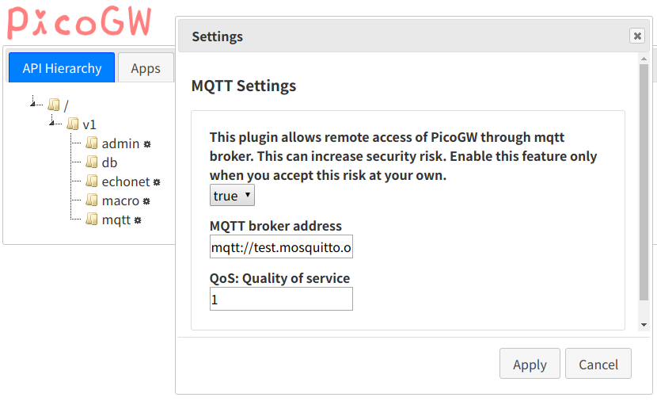

# MQTT plugin for PicoGW

This is a MQTT plugin package of [PicoGW](https://github.com/KAIT-HEMS/node-picogw), developed by Shigeru Owada@Sony CSL.

PicoGW MQTT plugin allows calls of PicoGW API through MQTT broker. However, because of its early development stage, it currently does not support authenticated access. Please understand that this plugin can increase vulnerablility of your network. We do not take any responsibility.

## Installation

```bash
npm i -g picogw   # Install Picogw
npm i -g picogw-plugin-mqtt   #Install MQTT plugin
```

## Running

```bash
picogw
```

## Uninstallation

```bash
npm un -g picogw-plugin-mqtt
npm un -g picogw
```

## How to use
Boot PicoGW with MQTT plugin and open the frontend **http://localhost:8080/**.
The **mqtt** object shows up under **/v1/**. Right click on it and then left click the **Settings** button to open **Settings** dialog.



By default, the first combobox is **'false'**, which means the plugin is not connected to MQTT broker yet. The MQTT broker address is defaulted to **mqtt://test.mosquitto.org**, and MQTT Quality of Service is **1**.
Please change the broker address (which can start with **mqtts://**) and QoS as desired, change the first item to **true** and press **Apply** button at the right-bottom. The plugin should connect to the broker.

The plugin subscribes to the topic whose name is the **MAC address** of the running machine plus **'-Req'** (eg. '11:22:33:44:55:66-Req'. The MAC address PicoGW knows (including itself) is listed under **/v1/admin/net**. Please check the MAC address which corresponds to the IP address of the machine.

The MQTT API client sends request to the topic **\[MAC ADDRESS\]-Req**, and receives the result at the topic **\[MAC ADDRESS\]**. Like websocket API, MQTT plugin provides both procedure call (that immediately returns the payloaded reply) and subscription (that returns the reply when published.)
Concrete client example is in [test-tool.js](test-tool.js).

## Testing feature

This plugin has two unnecessary APIs for testing purpose.
One is a dummy procedure call **/v1/mqtt/testProcedure**
The other is a dummy topic that publishes every two seconds **/v1/mqtt/testTopic**.
These two APIs are used in client example [test-tool.js](test-tool.js).